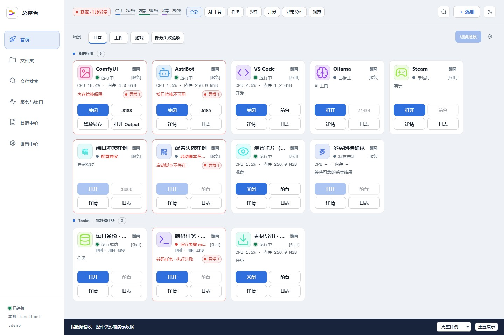
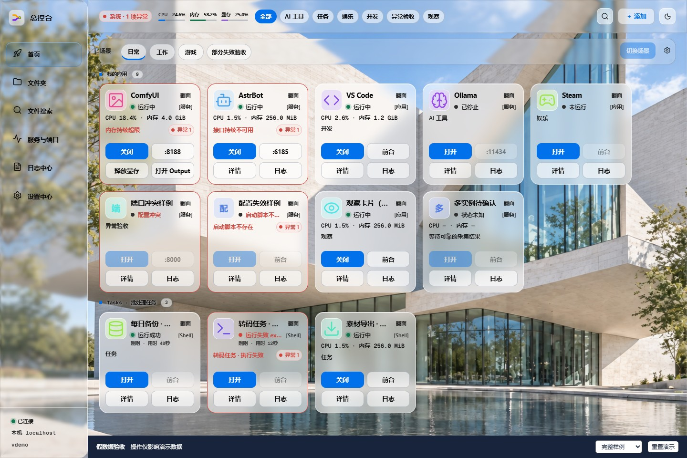
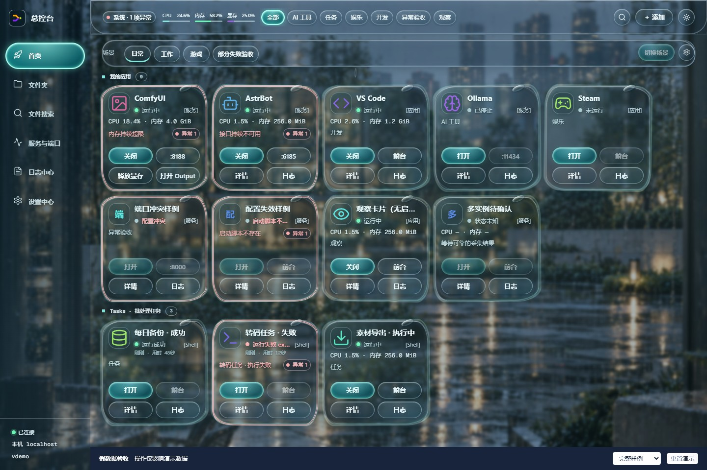
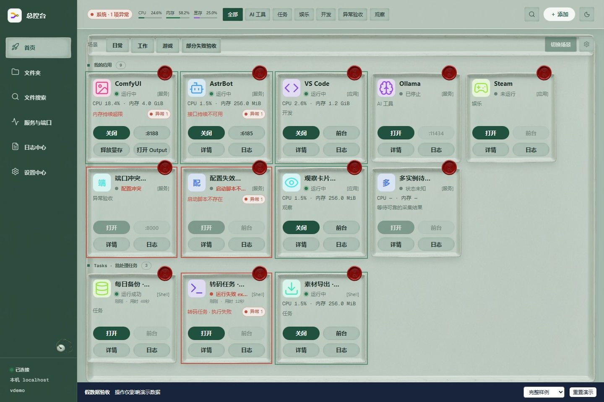
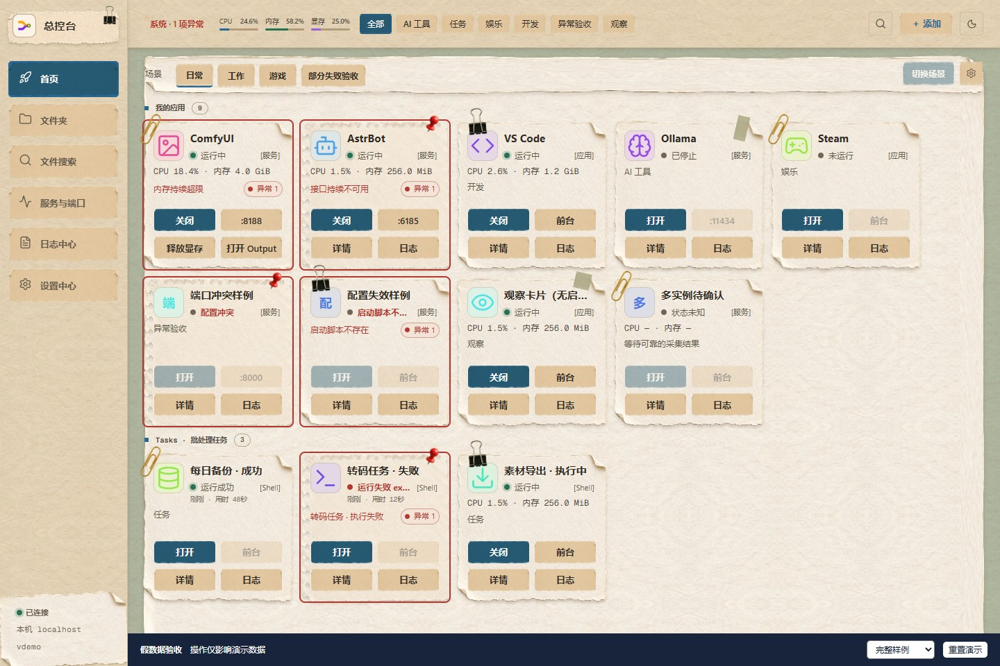
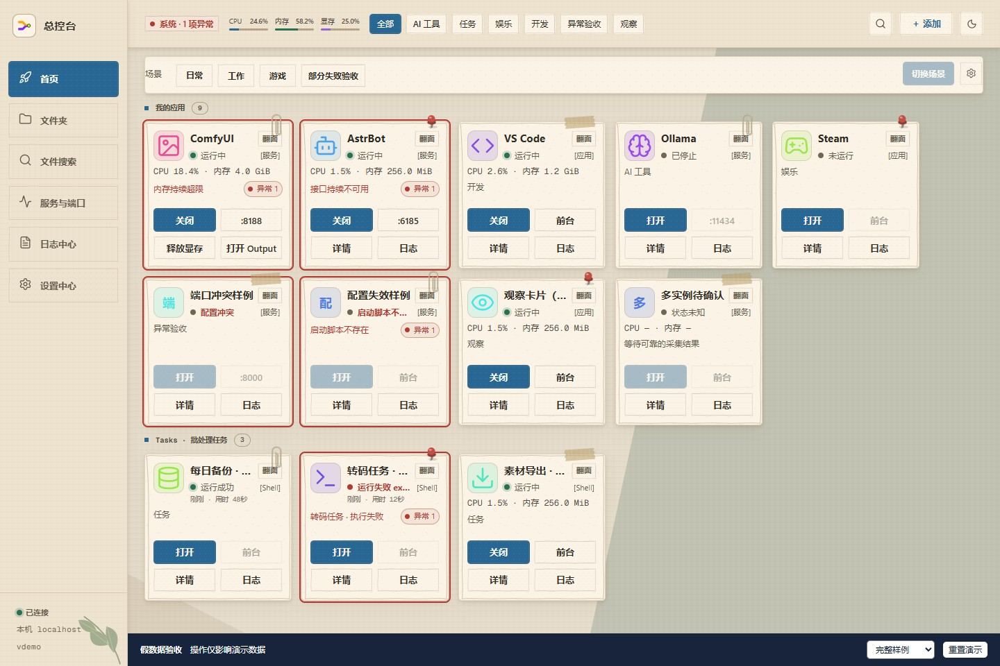
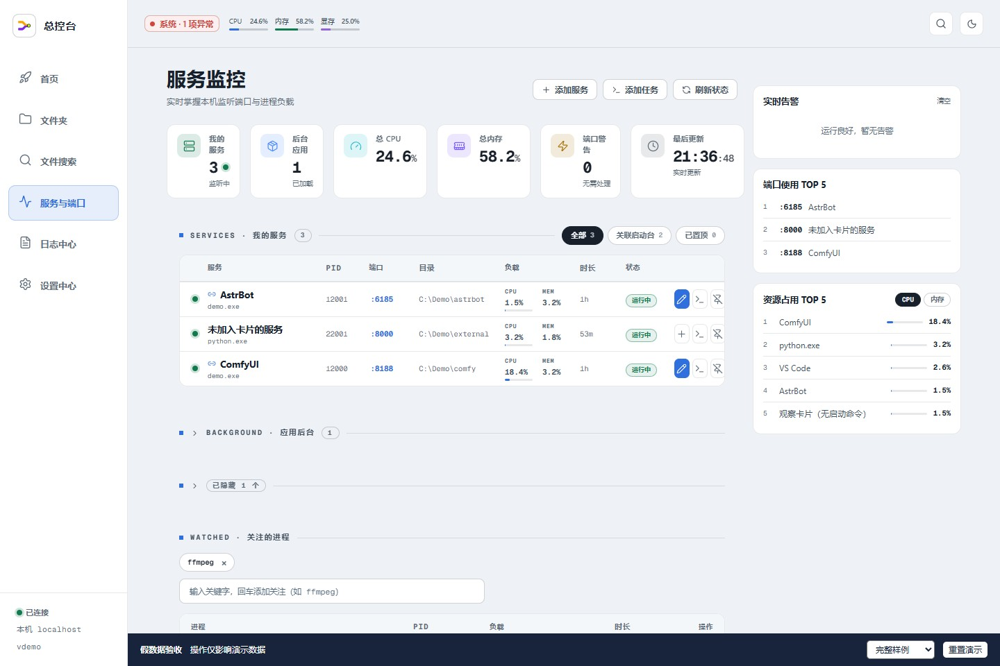

# Win Control Desk · Windows 总控台

**Windows 优先 · Preview / Alpha · 源码分发**

把常用桌面应用、服务、脚本和文件入口放到一个本机控制台：保存卡片、查看状态和资源、启动或关闭应用、切换场景。

项目基于 [pisceslailai/local-ops-win](https://github.com/pisceslailai/local-ops-win)，原始项目为 [laogou717/local-ops](https://github.com/laogou717/local-ops)。本仓库独立维护，保留原作者版权与 MIT 许可证。

后端使用 Python 标准库，前端为原生 HTML/CSS/JavaScript，无运行时 pip 依赖、前端构建或 CDN。

## 功能

- **启动台**：应用、服务和任务卡片，分类、排序、自定义按钮、相关位置与窗口关联。
- **应用包与场景**：批量操作应用，按保存的顺序切换工作环境。
- **监控与诊断**：进程树资源、监听端口、CPU/内存/显存、磁盘与目录增长、异常提醒、日志及配置诊断。
- **文件入口**：文件夹收藏，以及可选的 Everything CLI 搜索、QuickLook 预览。
- **主题**：极简、Apple、雨境、青瓷、剪纸和 Journal 素材框架，支持浅色、深色及系统外观。

具体操作见 [Windows 使用说明](docs/windows-entry.md)。

## 界面预览

以下为六个主题的浏览器实际截图，使用同一组虚构演示数据（1440 × 960）。点击图片可查看原图。

| 极简 · 浅色 | Apple · 浅色 |
| --- | --- |
|  |  |

| 雨境 · 深色 | 青瓷 · 浅色 |
| --- | --- |
|  |  |

| 剪纸 · 浅色 | Journal · 素材框架示例 |
| --- | --- |
|  |  |

<details>
<summary>服务监控预览（极简主题）</summary>



</details>

## Windows 安装与启动

需要 **Windows 10/11 x64、Python 3.12+、近期版本的 Chrome 或 Edge**。项目按源码分发，启动时需要完整源码目录和本机 Python。

1. 获取源码：

   ```powershell
   git clone https://github.com/qy4747/win-control-desk.git
   cd win-control-desk
   ```

   也可使用 **Code → Download ZIP**，解压到固定可写目录，例如 `D:\Apps\win-control-desk`。

2. 从 [Python 官方下载页](https://www.python.org/downloads/windows/) 安装 Python，同时安装 Python Launcher 或将 `python` 加入 PATH。验证版本：

   ```powershell
   py -3.12 --version
   # 没有 Python Launcher 时：
   python --version
   ```

3. 双击根目录的 **`start.bat`**。启动器优先使用 Python 3.12，也接受更高版本，随后打开浏览器。

服务绑定 `127.0.0.1`，默认在 9600–9609 中选择可用端口。排错时从 PowerShell 运行 `.\start.bat` 以保留输出；也可指定端口并手动打开页面：

```powershell
py -3.12 server.py --no-browser --preferred-port 9603
```

实际地址以启动输出为准。独立窗口和快捷方式辅助脚本是可选入口。

## 第一次使用

从“添加”保存启动命令，或从运行中发现并关联应用。没有可靠启动命令时，可先保存为观察卡片，补齐配置后再启动。

卡片控制对应应用，设置中心的停止/重启控制总控台自身。关闭网页后，后台监控继续运行；停止总控台后，已启动的应用继续运行。

控制台以当前用户权限执行保存的命令，请仅导入可信配置，保持本机使用。详见 [安全政策](SECURITY.md)。

Everything 搜索需另行安装并运行 Everything，设置好 CLI 路径；预览需安装并运行 QuickLook。

## 数据、升级与卸载

| 内容 | Windows 默认位置 |
| --- | --- |
| 配置与图标 | `%APPDATA%\总控台` |
| 日志 | `%LOCALAPPDATA%\总控台\Logs` |

`CONSOLE_DATA_DIR` / `CONSOLE_LOG_DIR` 可指定独立绝对目录。旧版项目内 `data/` 符合迁移条件时会复制到默认位置，源文件保留。可选入口 `tools/launch_console.py` 使用项目内 `data/` 和 `data/logs/`；切换入口时核对所用配置。

- **升级**：停止总控台，备份配置、图标和所需日志，再更新完整源码。Git 用户先处理未提交改动。
- **恢复**：配套恢复代码和配置备份。配置迁移会保留备份，程序拒绝写入比自身支持版本更新的配置。
- **卸载**：停止总控台，按需删除源码、配置、日志及通知身份快捷方式 `Cddeck 总控台.lnk`。受管应用需要单独关闭。

产品版本见 [VERSION](VERSION)，配置格式见 [开发说明](docs/development.md#配置)。

## 平台与维护

Windows 是主要验收平台。macOS 保留 `start.command` 和 `.app` 兼容入口，原生桌面行为及 Safari 尚未全面验证；Windows 窗口、通知、Everything 和 QuickLook 功能有平台限制。

项目由个人维护。普通问题通过 Issues 反馈，安全问题见 [SECURITY.md](SECURITY.md)，提交附件前按其中的[脱敏规则](SECURITY.md#脱敏规则)处理。

## 开发与 AI 助手

开发环境、检查命令见 [CONTRIBUTING.md](CONTRIBUTING.md)，模块与接口见 [开发说明](docs/development.md)，发布步骤见 [发布核对表](RELEASE_CHECKLIST.md)。

页面预览可运行 `py -3.12 tools/ui_demo.py --port 9610`，详见 [UI 演示与验收](docs/ui-acceptance.md)。

源码包含两份可选 Skill：

| Skill | 用途 |
| --- | --- |
| [win-control-desk-apps](skills/win-control-desk-apps/SKILL.md) | 发现应用，配置卡片、按钮、位置和窗口关联。 |
| [win-control-desk-skins](skills/win-control-desk-skins/SKILL.md) | 制作主题、浅深配色、素材和预览。 |

让 AI 助手在本项目中读取对应 `SKILL.md`，再说明任务即可。例如：“阅读应用接入 Skill，把指定应用加入总控台并配置项目目录入口。”

也可将 Skill 完整目录（含 `references`）复制到 AI 客户端支持的项目级 Skills 目录。跨工作区使用时指定本项目源码路径。应用接入需要运行中的总控台实例；图片生成由所用 AI 环境提供。

## 许可

项目使用 [MIT LICENSE](LICENSE)。第三方代码、字体与素材的来源、许可及待核实项见 [第三方声明](THIRD_PARTY_NOTICES.md) 和 [素材台账](ASSET_PROVENANCE.md)。
